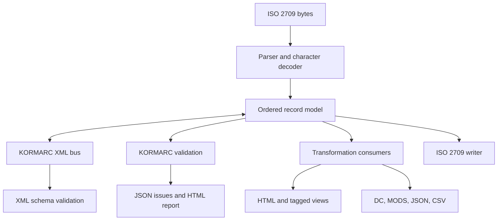

# Architecture

KORMARCXML is an unofficial processing framework, not a newly approved KORMARC
standard. Its core is a generic ordered record model and XML bus, with independent
KORMARC semantic profiles. [ADR 001](adr/001-xml-transport.md) records the choice
of vocabulary and its limits; [ADR 002](adr/002-stack.md) records the stack choice.

## Data flow

The XML bus uses `collection`, `record`, `leader`, `controlfield`, `datafield`, and
`subfield` elements in the MARCXML namespace. KORMARC content rules belong to the
selected profile, not to the namespace. Institutions must communicate profile
identity in pipeline configuration or an external manifest.

## Module responsibilities

| Module/resource | Responsibility |
|---|---|
| `model.py` | Leader, ordered fields/subfields, lookup and copy-returning edits |
| `iso2709.py` | Framing, directory byte counts, delimiters, decoding and encoding |
| `xmlio.py` | Secure XML parsing/writing, collection iteration, XSD checks |
| `schema/kormarcxml.xsd` | Independently authored generic structural schema |
| `resources/rules/bibliographic.json` | Versioned, source-linked partial semantic profile |
| `validation.py` | Level 2/3 rule evaluation, profile merging, extension callbacks |
| `transforms.py` | Presentations, lossy crosswalks, JSON adapter, custom consumers |
| `cli.py` | Files, arguments, streaming orchestration, process exit codes |
| `errors.py` | Structured issues and fatal exceptions |

There is no network lookup on a conversion path. The library can be imported
without the CLI. A caller controls its streams, profile, encoding, and output
promotion. Dataclasses are frozen but their list members are not deeply immutable;
use copy-returning edit helpers and avoid mutating shared lists.

## Three validation boundaries

1. `schema_validate(xml)` checks the original XML against the bundled structural
   XSD. This is not validation against LC's official XSD.
2. `validate(record, level=2)` evaluates generic logical structure and verified
   tagging constraints. Physical ISO 2709 bounds are checked by the parser first.
3. `validate(record, level=3)` also evaluates the implemented value, date, and
   conditional content rules. No absent rule is inferred from MARC 21.

The CLI combines per-record XSD validation with levels 2/3; the library API keeps
the gates separate.

Parsing and semantic validation are independent: a readable field with an unknown
tag can be preserved and reported without discarding it. Unsafe or unrepresentable
structures cause parse errors. Unknown semantic fields produce coverage issues;
local 9XX fields are retained.

## Physical and logical preservation

The logical model retains the 24-character Leader and textual content. The ISO
writer recomputes Leader/00–04, Leader/12–16, the directory, and terminators.
Directory offsets are byte counts in the selected output encoding. The model does
not store original directory bytes, codec provenance, or a raw-byte shadow.

No Unicode normalization is performed. Code-point identity is therefore a distinct
claim from visually identical text. XML 1.0-illegal characters are rejected rather
than silently deleted. See [ISO 2709](iso2709.md) and [encoding](encoding.md).

## Streaming and operational behavior

`iter_iso2709` reads one framed record at a time. `iter_xml` yields a record and
clears processed elements; `write_xml` emits a collection incrementally. Consumers
must also process incrementally rather than wrapping the iterator in `list()`.

Whole-document XSD validation is deliberately bounded to 10 MiB. For large
collections, validate individual serialized records alongside a streaming parse;
this does not replace validating every original collection-level XSD constraint.
The CLI's transform operation writes one output document per record when
`--output-dir` is selected. The `batch` command is a streaming conversion adapter,
not a job queue or a parallel distributed processor.

The CLI promotes named output files atomically on success. Standard output and
per-record output directories may already contain earlier records after a fatal
error. Library applications should use a temporary path and promote it after success. Resynchronization,
quarantine queues, checkpoints, and automatic repair are future work.

## Security

XML parsing disables external entity resolution, DTD loading, and network access;
DTD declarations are rejected. Parser depth and record-size limits bound inputs.
HTML uses XML-library text escaping, not interpolation of source values into
markup. The built-in transformations do not execute user-supplied XSLT. Custom
Python callbacks are trusted application code. CSV preserves source values and
must be imported as text when a spreadsheet might interpret formulas.

## Adding a consumer

Use the `Record` model as the consumer boundary, then register a transform with
an explicit limitation statement or pass a validator callback. See runnable
examples in [API](api.md). A future RDF, BIBFRAME, or institutional exporter can
consume the same ordered model without changing the transport vocabulary. Such
an exporter still needs a reviewed semantic mapping and its own tests; interface
extensibility is not evidence that these exporters already exist.
